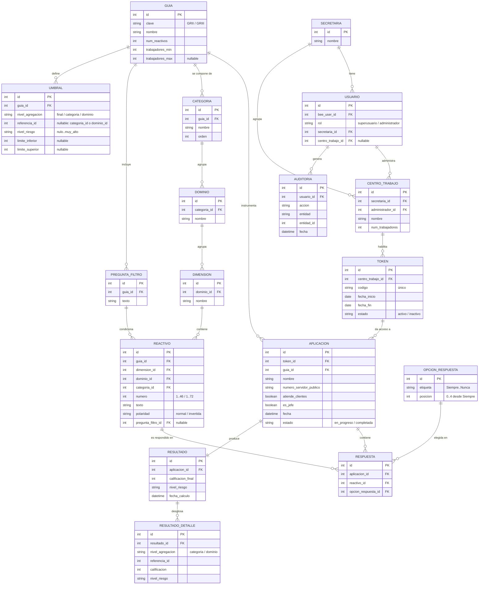

# Modelo Entidad-Relación — Sistema NOM-035-STPS-2018

> Entregable de la fase de Diseño · Secretaría de Cultura y Turismo del Estado de México
> Bee Framework 1.5.8 · MySQL/MariaDB

Este documento define el modelo de datos del sistema, derivado del texto oficial
de la NOM-035 (Guías de Referencia II y III). Es la base para el script SQL y
para el motor de calificación.

---

## 1. Panorama: dos mundos de datos

El modelo se divide en dos grandes bloques que conviene no mezclar:

- **El instrumento (catálogo).** Datos que provienen de la norma y son
  prácticamente estáticos: las guías, sus reactivos, la estructura
  categoría→dominio→dimensión, las preguntas-filtro, la escala de respuesta y
  los umbrales de riesgo. Se cargan **una vez** (seed) y casi no cambian.
- **La operación (transaccional).** Datos que genera el uso diario: secretarías,
  usuarios, centros de trabajo, tokens, aplicaciones respondidas, respuestas,
  resultados y bitácora.

El puente entre ambos son tres relaciones: una `aplicacion` se responde bajo una
`guia`, cada `respuesta` apunta a un `reactivo` y a una `opcion_respuesta`.

---

## 2. Diagrama entidad-relación

---

## 3. Entidades del instrumento (catálogo)

| Entidad | Propósito | Notas / origen en la norma |
|---|---|---|
| `guia` | Las dos versiones del cuestionario. | `trabajadores_min/max` define la selección automática (RF-00): GRII = 16–50; GRIII = 51–∞. |
| `categoria` | Categorías de cada guía. | GRII tiene 4; GRIII tiene 5 (agrega "Entorno organizacional"). Pertenecen a una guía. |
| `dominio` | Dominios dentro de una categoría. | GRIII tiene 10; GRII menos. Tabla 3 / Tabla 6. |
| `dimension` | Dimensiones dentro de un dominio (grano más fino). | 25 en GRIII. No se califica a este nivel, pero da fidelidad y sirve para reportes. |
| `pregunta_filtro` | Las dos preguntas Sí/No de ramificación. | "¿Brindo servicio a clientes?" y "¿Soy jefe?". |
| `reactivo` | Cada ítem del cuestionario. | `polaridad` (normal/invertida) según Tablas 2 y 5. `pregunta_filtro_id` marca los reactivos condicionales. |
| `opcion_respuesta` | La escala Likert de 5 opciones. | Guarda `posicion` (0=Siempre … 4=Nunca). **El valor no se guarda aquí**: se calcula según la polaridad del reactivo (ver §6.1). |
| `umbral` | Todos los rangos de nivel de riesgo. | Un solo lugar para los umbrales final, por categoría y por dominio, de ambas guías (Tablas 3, 6 y rangos). |

**Nota de diseño (denormalización deliberada):** `reactivo` guarda además
`dominio_id` y `categoria_id`, aunque se podrían deducir subiendo por la
jerarquía. Como el instrumento es estático, esta pequeña redundancia hace que las
consultas de calificación sean triviales (un solo `JOIN`) y elimina errores de
agregación. Es una decisión consciente, no un olvido de normalización.

---

## 4. Entidades de la operación (transaccional)

| Entidad | Propósito | Notas / decisiones |
|---|---|---|
| `secretaria` | Dependencia titular (multi-dependencia). | Este despliegue: Cultura y Turismo. |
| `usuario` | Tabla de **enlace** con `bee_users`. | Decisión A: Bee es la única fuente de login/roles; esta tabla añade `rol`, `secretaria_id` y `centro_trabajo_id`. **No** duplica usuarios. |
| `centro_trabajo` | Centro de trabajo evaluado. | `num_trabajadores` determina la guía. `administrador_id` = usuario responsable. |
| `token` | Acceso por campaña. | Decisión B: **uno por centro por campaña**, multiuso durante su vigencia (`fecha_inicio`–`fecha_fin`). |
| `aplicacion` | Un cuestionario respondido. | Guarda identidad del encuestado (`nombre`, `numero_servidor_publico`) y las respuestas a los filtros. **`guia_id` se congela aquí** al momento de responder. |
| `respuesta` | La opción elegida en cada reactivo. | Apunta a `reactivo` y a `opcion_respuesta`. |
| `resultado` | Calificación final y nivel de riesgo. | 1 a 1 con `aplicacion`. |
| `resultado_detalle` | Desglose por categoría y por dominio. | Guarda calificación y nivel de cada dominio/categoría. |
| `auditoria` | Bitácora de movimientos y consultas. | Ligada al `usuario` que actúa (RF-09, RF-12). |

**Restricciones de integridad clave:**

- `token.codigo` → **único**.
- `aplicacion` → **único** `(token_id, numero_servidor_publico)`: cada servidor
  público responde una sola vez por campaña.
- `respuesta` → **único** `(aplicacion_id, reactivo_id)`: una respuesta por
  reactivo.
- `reactivo` → **único** `(guia_id, numero)`.
- `resultado` → **único** `(aplicacion_id)`.

---

## 5. Cómo se traduce la norma al modelo

### 5.1 Polaridad y valor de cada respuesta
La escala tiene 5 opciones; guardamos su `posicion` (0=Siempre … 4=Nunca). El
valor de puntos depende de la polaridad del reactivo:

- **Reactivo normal** (describe un riesgo; *Siempre* = peor): `valor = 4 - posicion`.
- **Reactivo invertido** (redactado en positivo; *Siempre* = mejor): `valor = posicion`.

Así, la misma tabla `opcion_respuesta` sirve para todos los reactivos y el valor
se calcula al vuelo. Las listas oficiales de polaridad:

- **Guía II** — invertidos (0→4): 18–33. Normales (4→0): 1–17, 34–46.
- **Guía III** — invertidos (0→4): 1, 4, 23–28, 30–53 (salvo 54), 55, 56, 57.
  Normales (4→0): el resto (2, 3, 5–22, 29, 54, 58–72).

*(Las listas exactas se transcriben literalmente de las Tablas 2 y 5 al sembrar
`reactivo.polaridad`.)*

### 5.2 Ruta de cálculo
1. Por cada `respuesta`, calcular su `valor` según §5.1.
2. **Calificación por dominio (Cdom):** sumar los valores de los reactivos del dominio.
3. **Calificación por categoría (Ccat):** sumar los valores de los reactivos de la categoría.
4. **Calificación final (Cfinal):** sumar los valores de todos los reactivos respondidos.
5. Ubicar cada calificación en su nivel de riesgo consultando `umbral`.

Los reactivos omitidos por los filtros simplemente no tienen `respuesta`, así que
no suman. El grano `dimension`/`dominio`/`categoria` en `reactivo` hace que cada
suma sea un `GROUP BY`.

### 5.3 Umbrales — calificación final (para sembrar `umbral`)

| Nivel | Guía II (Cfinal) | Guía III (Cfinal) |
|---|---|---|
| Nulo o despreciable | < 20 | < 50 |
| Bajo | 20 – 44 | 50 – 74 |
| Medio | 45 – 69 | 75 – 98 |
| Alto | 70 – 89 | 99 – 139 |
| Muy alto | ≥ 90 | ≥ 140 |

> Los rangos por **categoría** y por **dominio** (Tablas 3 y 6) se cargan igual en
> `umbral`, con `nivel_agregacion` = 'categoria' / 'dominio' y `referencia_id`
> apuntando a la categoría o dominio correspondiente.
>
> **Convención de límites:** la norma escribe los rangos con "<" en ambos
> extremos (p. ej. `50<Cfinal<75`). En el código se interpretan como
> `limite_inferior ≤ valor < limite_superior` (límite inferior inclusivo), que es
> la lectura estándar; el nivel más bajo no tiene `limite_inferior` y el más alto
> no tiene `limite_superior`.

### 5.4 Lógica condicional (filtros)
Cada `pregunta_filtro` habilita un grupo de reactivos vía `reactivo.pregunta_filtro_id`:

| Filtro | Guía II | Guía III |
|---|---|---|
| Brinda servicio a clientes | 41–43 | 65–68 |
| Es jefe de otros | 44–46 | 69–72 |

En `aplicacion` se guardan las respuestas `atiende_clientes` y `es_jefe`; si son
"No", esos reactivos no se muestran ni se registran.

### 5.5 Selección de guía
Al registrar un `centro_trabajo`, su `num_trabajadores` elige la guía consultando
`guia.trabajadores_min/max` (16–50 → Guía II; más de 50 → Guía III). Los centros
de hasta 15 trabajadores quedan fuera del alcance del cuestionario según la norma.

---

## 6. Decisiones de diseño clave (resumen)

- **Instrumento parametrizado, no "quemado":** toda la norma vive en datos
  (`guia`, `categoria`, `dominio`, `dimension`, `reactivo`, `umbral`), así el
  mismo motor califica ambas guías y sobrevive a una futura reforma de la norma.
- **Valor por polaridad calculado, no almacenado:** una sola escala Likert.
- **`umbral` genérico:** una tabla cubre los tres niveles de agregación de ambas
  guías, en vez de columnas fijas.
- **`guia_id` congelado en `aplicacion`:** si un centro cambia de tamaño después,
  las aplicaciones ya respondidas conservan la guía con la que se calificaron.
- **Identidad separada de la operación:** `usuario` como enlace a `bee_users`
  mantiene una sola fuente de autenticación.

---

## 7. Lo que sigue

1. **Script SQL (DDL):** crear las tablas nuevas con sus llaves y restricciones.
2. **Seed del instrumento:** poblar `guia`, `categoria`, `dominio`, `dimension`,
   `pregunta_filtro`, `reactivo` (con texto y polaridad), `opcion_respuesta` y
   `umbral` a partir de las Tablas 2–6 de la norma.
3. **Verificación:** calcular a mano un cuestionario de ejemplo y contrastarlo
   contra el motor.

> El seed es la parte más delicada: cualquier error de polaridad o de mapeo
> reactivo→dominio produce calificaciones incorrectas. Se transcribe literal de
> la norma y se verifica con casos de prueba.
